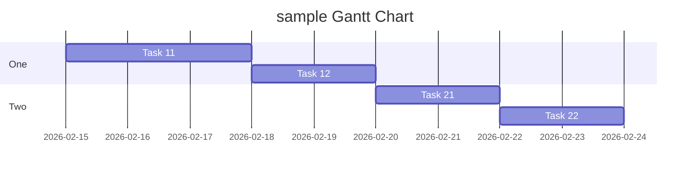
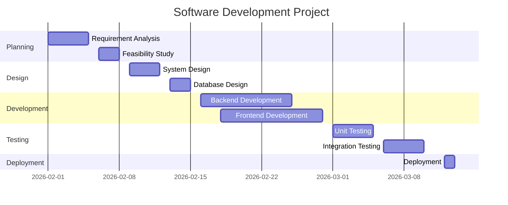
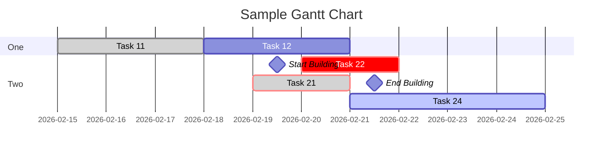
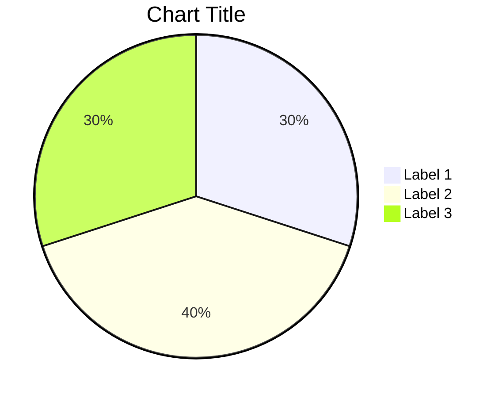
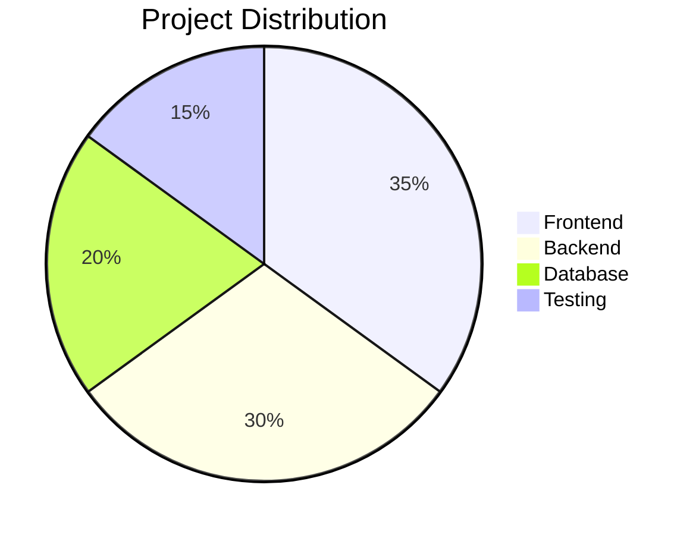

## Gantt Chart :
A Ghantt chart is bar chart commonly used in project management to visulize and track the schedule of a project . It provide a clear and concise overview of the project's tasks, duration , dependencies and milestones over time.

**Syntax:**
The Gantt chart starts with the gantt keyword.
gantt
    title Project Title
    dateFormat YYYY-MM-DD
    section Section Name
    Task Name : task_id, start_date, duration

---

gantt 
    title sample Gantt Chart 
    section One 
        Task 11: a11 , 2026-02-15,3d
        Task 12: a12 , after a11,2d
    section Two
        Task 21: a21, 2026-02-20,2d
        Task 22: 2026-02-22, 2d

 * It is important to remember that when a date, day, or collection of dates specific to a task are "excluded", 
 the Gantt Chart will accommodate those changes by extending an equal number of days,
  towards the right, not by creating a gap inside the task


* A Gantt chart is useful for tracking the amount of time it would take before a project is finished, but it can also be used to graphically represent "non-working days", with a few tweaks.

---

**EXAMPLE:**



**CODE:**

gantt
    title Software Development Project
    dateFormat YYYY-MM-DD
    section Planning
    Requirement Analysis : 2026-02-01, 2026-02-05
    Feasibility Study    : 2026-02-06, 2026-02-08
    section Design
    System Design        : 2026-02-09, 2026-02-12
    Database Design      : 2026-02-13, 2026-02-15
    section Development
    Backend Development  : 2026-02-16, 2026-02-25
    Frontend Development : 2026-02-18, 2026-02-28
    section Testing
    Unit Testing         : 2026-03-01, 2026-03-05
    Integration Testing  : 2026-03-06, 2026-03-10
    section Deployment
    Deployment           : 2026-03-12, 2026-03-13

---

**Title:**
The title is an optional string to be displayed at the top of the Gantt chart to describe the chart as a whole.

**Excludes:**
The excludes is an optional attribute that accepts specific dates in YYYY-MM-DD format, days of the week ("sunday") or "weekends", but not the word "weekdays". These date will be marked on the graph, and be excluded from the duration calculation of tasks. 

**Weekend:**
When excluding weekends, it is possible to configure the weekends to be either Friday and Saturday or Saturday and Sunday. By default weekends are Saturday and Sunday. To define the weekend start day, there is an optional attribute weekend that can be added in a new line followed by either friday or saturday.

**Section statements:**
You can divide the chart into various sections, for example to separate different parts of a project like development and documentation.

**Milestones:**
You can add milestones to the diagrams. Milestones differ from tasks as they represent a single instant in time and are identified by the keyword milestone. Below is an example on how to use milestones.

**Vertical Markers:**
The vert keyword lets you add vertical lines to your Gantt chart, making it easy to highlight important dates like deadlines, events, or checkpoints. These markers extend across the entire chart and are positioned based on the date you provide.

---

## Adding Milestones & Compact :

**CODE:**

---
displayMode: compact
gantt
title Sample Gantt Chart
dateFormat YYYY-MM-DD

section One
Task 11 :done,a11,2026-02-15,3d
Task 12 :a12,after a11,3d

section Two
Start Building :milestone,m1,2026-02-19,1d
Task 21 :crit,done,a21,2026-02-19,2d
Task 22 :crit,2026-02-20,2d
End Building :milestone,m2,after a21,1d
Task 24 :active,after a12,4d

---

##  Pie Chart :

* A pie chart is a circular statistical graphic that is divided into slice to illustrate numerical proportions. It is a popular way to represent data in a visually appealing and easy-to-understand format

**It is used to represent:**

* Percentage distribution
* Data comparison
* Resource allocation
* Project contribution

**Syntax:**
pie
    title Chart Title
    "Label 1" : 30
    "Label 2" : 40
    "Label 3" : 30

---


**Syntax Structure :**
| Element       | Syntax           | Description      |
| ------------- | ---------------- | ---------------- |
| pie           | pie              | starts pie chart |
| title         | title Chart Name | chart title      |
| "Label"       | "Frontend"       | category name    |
| value         | : 30             | numeric value    |
| mermaid block | ```mermaid       | required block   |
---

**EXAMPLE:**



**CODE:**

pie
title Project Distribution
"Frontend" : 35
"Backend" : 30
"Database" : 20
"Testing" : 15

---

