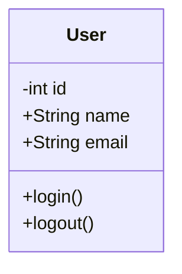
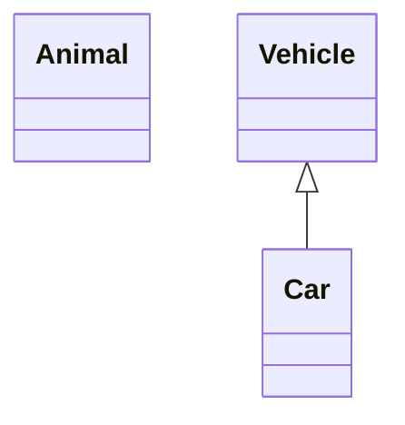
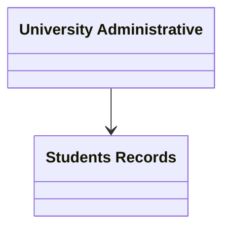

# Class Diagrams 

##  Introduction
A **Class Diagram** in the **Unified Modeling Language (UML)** is a static
structural diagram that describes the structure of a system by showing its
classes, attributes, operations (methods), and the relationships among them.

Class diagrams form the foundation of object-oriented modeling and are used
for both high-level conceptual design and detailed implementation-level design.
They can also be applied to data modeling and system documentation.

##  Purpose of Class Diagrams
Class diagrams are used to:
- Visualize the static structure of a system
- Define class responsibilities
- Represent relationships between classes
- Serve as a blueprint for implementation
- Improve communication between developers and stakeholders

In simple terms, a class diagram shows **how the system code is structured**.

## Class Representation in UML
In UML:
- Classes are represented as rectangles
- Relationships are represented by connecting lines
- Each class is divided into three compartments:
  1. Class Name
  2. Attributes
  3. Methods

##  UML Class Structure

| Compartment | Description |
|------------|-------------|
| Top | Class name (bold, centered, capitalized) |
| Middle | Attributes (data members) |
| Bottom | Methods (operations/behaviors) |

##  UML Class Syntax

### Access Modifiers

| Symbol | Meaning |
|------|--------|
| `+` | Public |
| `-` | Private |
| `#` | Protected |

##  Basic Class Example

## Define a class

There are two ways to define a class:
* Explicitly using keyword class like class Animal which would define the Animal class.
* Via a relationship which defines two classes at a time along with their relationship. For instance, Vehicle <|-- Car.

## Class Labels:

**Code**
classDiagram 
    class University["University Administrative"]
    class Student["Students Records"]
    University --> Student

# Members of a Class (UML)

## Introduction
In UML, the **members of a class** define its internal structure and behavior.
They specify **what data a class contains** and **what actions it can perform**.
Class members are essential for modeling object-oriented systems accurately.

A class primarily consists of **attributes** and **methods**, along with
access modifiers that control visibility.

##  Attributes (Data Members)

**Attributes** represent the data or properties of a class.  
They define the **state** of an object created from that class.

### Characteristics
- Located in the **middle compartment** of a UML class
- Usually written in **lowercase**
- Defined using access modifiers
- Represent variables stored in the class