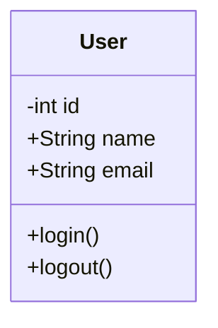
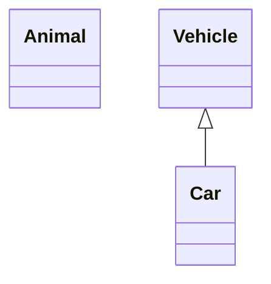
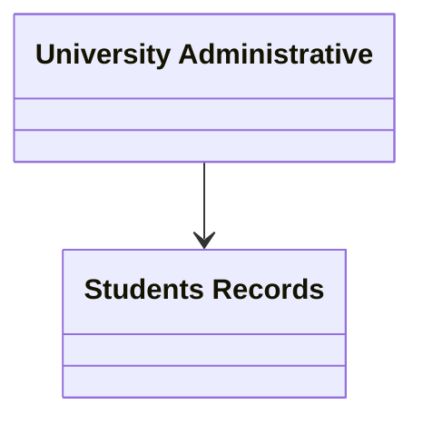
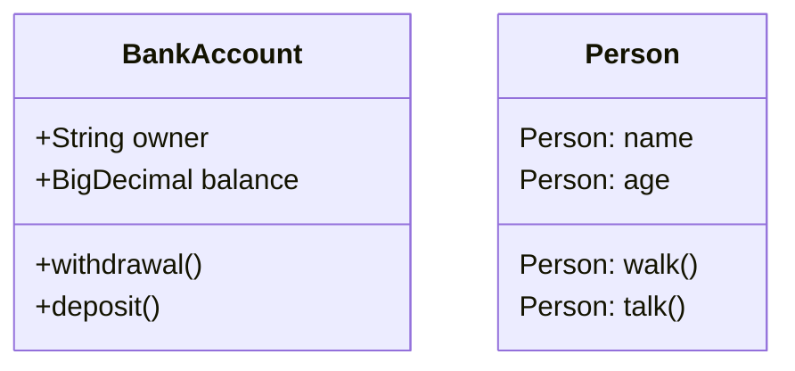
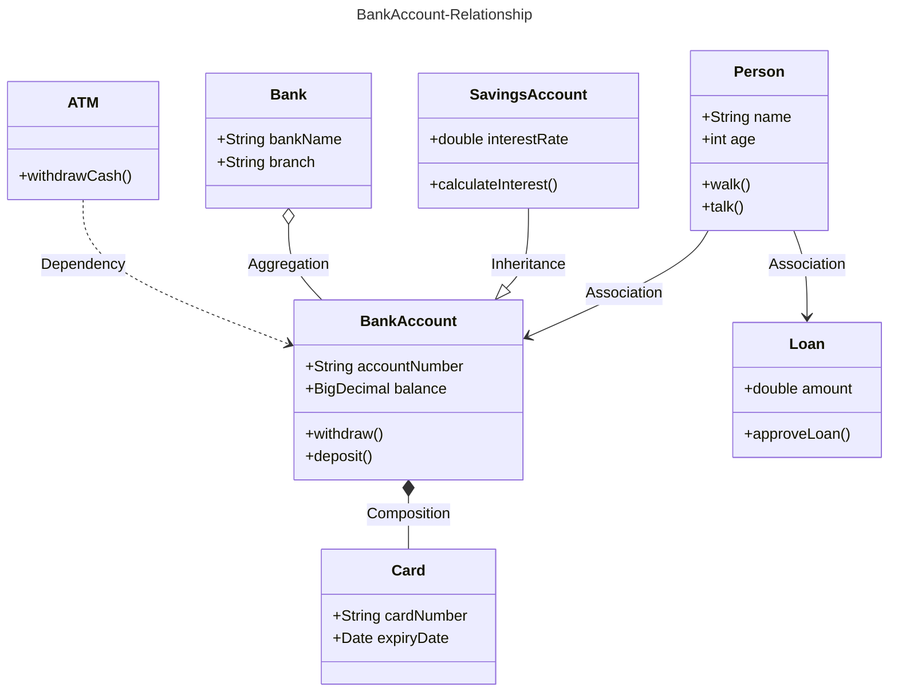
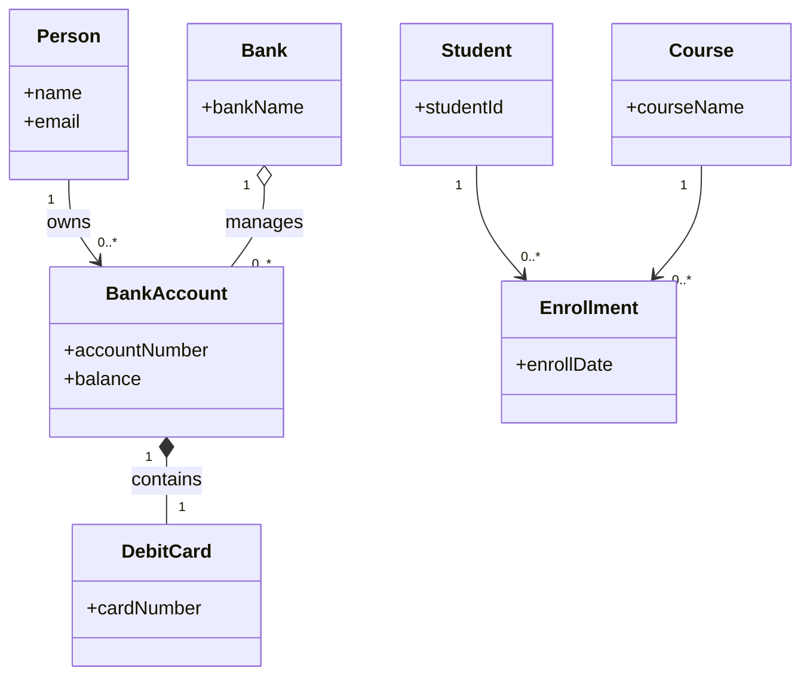
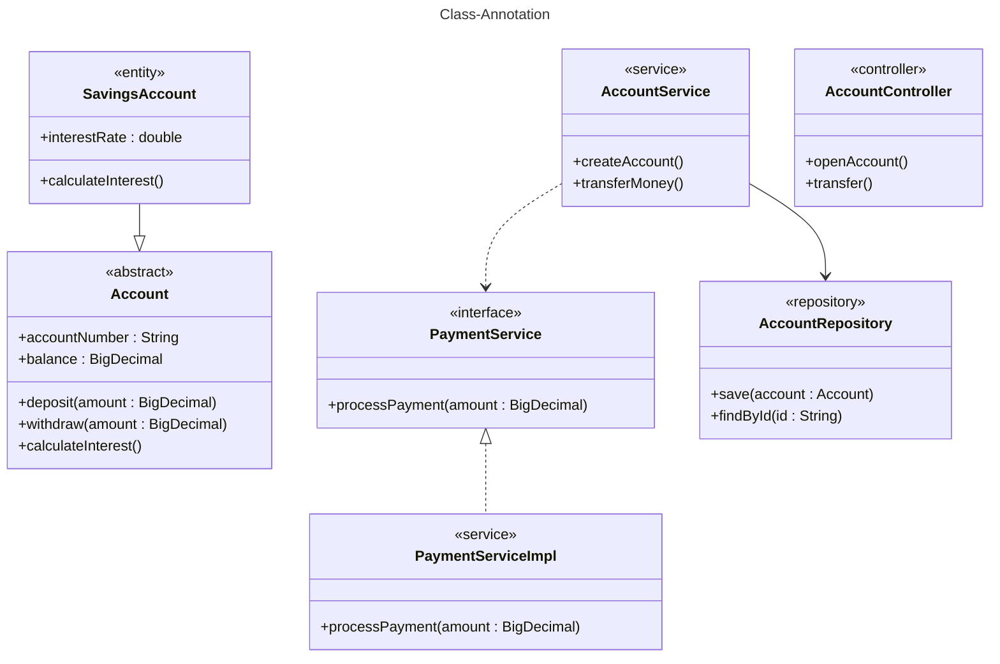
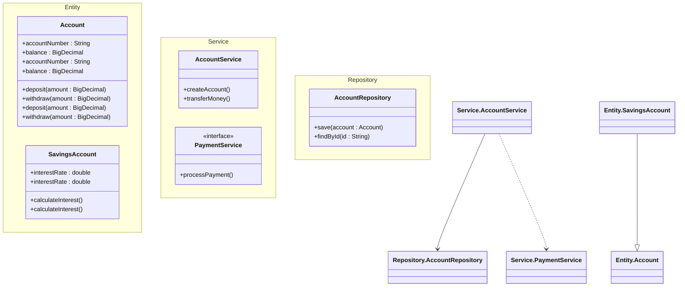
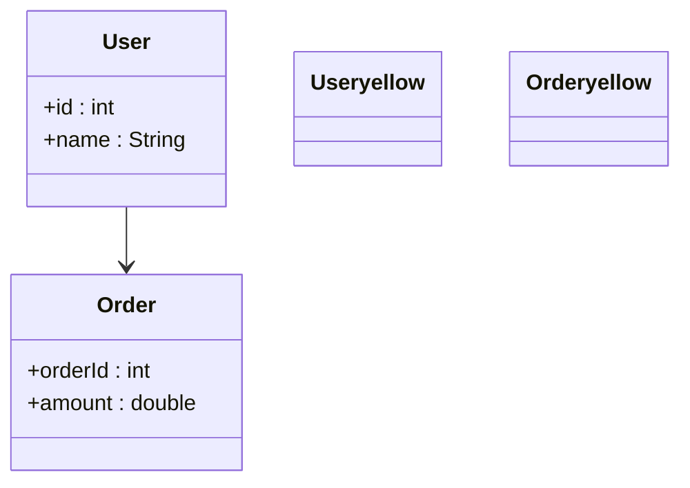

# Class Diagrams 

##  Introduction
A **Class Diagram** in the **Unified Modeling Language (UML)** is a static
structural diagram that describes the structure of a system by showing its
classes, attributes, operations (methods), and the relationships among them.

Class diagrams form the foundation of object-oriented modeling and are used
for both high-level conceptual design and detailed implementation-level design.
They can also be applied to data modeling and system documentation.


##  Purpose of Class Diagrams
Class diagrams are used to:
- Visualize the static structure of a system
- Define class responsibilities
- Represent relationships between classes
- Serve as a blueprint for implementation
- Improve communication between developers and stakeholders

In simple terms, a class diagram shows **how the system code is structured**.


## Class Representation in UML
In UML:
- Classes are represented as rectangles
- Relationships are represented by connecting lines
- Each class is divided into three compartments:
  1. Class Name
  2. Attributes
  3. Methods


##  UML Class Structure

| Compartment | Description |
|------------|-------------|
| Top | Class name (bold, centered, capitalized) |
| Middle | Attributes (data members) |
| Bottom | Methods (operations/behaviors) |


##  UML Class Syntax

### Access Modifiers

| Symbol | Meaning |
|------|--------|
| `+` | Public |
| `-` | Private |
| `#` | Protected |


##  Basic Class Example



## Define a class

There are two ways to define a class:
* Explicitly using keyword class like class Animal which would define the Animal class.
* Via a relationship which defines two classes at a time along with their relationship. For instance, Vehicle <|-- Car.



## Class Labels:

**Code**
classDiagram 
    class University["University Administrative"]
    class Student["Students Records"]
    University --> Student




# Members of a Class (UML)

## Introduction
In UML, the **members of a class** define its internal structure and behavior.
They specify **what data a class contains** and **what actions it can perform**.
Class members are essential for modeling object-oriented systems accurately.

A class primarily consists of **attributes** and **methods**, along with
access modifiers that control visibility.

##  Attributes (Data Members)

**Attributes** represent the data or properties of a class.  
They define the **state** of an object created from that class.

### Characteristics
- Located in the **middle compartment** of a UML class
- Usually written in **lowercase**
- Defined using access modifiers
- Represent variables stored in the class

## Defining The Class :

classDiagram 
class BankAccount{   <--- **This is the first class Define as BankAccount**
BankAccount : +String owner 
BankAccount : +BigDecimal balance
BankAccount : +withdrawal()
BankAccount : +deposit()
}
class Person { <--**This is second Class define as Person**
    Person: name
    Person: age 
    Person: walk()
    Person: talk()
}

## Class Relationship :
A relationship is a general term covering the specific types of logical connections found on class and object diagrams.

| | Relationship                     | Meaning                                | Strength            | UML Symbol | Example                  | Real-World Meaning         |          |                     |
| -- | -------------------------------- | -------------------------------------- | ------------------- | ---------- | ------------------------ | -------------------------- | -------- | ------------------- |
| 1  | **Association**                  | General connection between two classes | Normal              | `----`     | Student ---- Course      | Student enrolls in Course  |          |                     |
| 2  | **Inheritance (Generalization)** | Child class inherits from parent class | Strong (is-a)       | `--        | >`                       | Student --                 | > Person | Student is a Person |
| 3  | **Aggregation**                  | Weak whole-part relationship           | Weak (has-a)        | `o--`      | Department o-- Professor | Department has Professors  |          |                     |
| 4  | **Composition**                  | Strong whole-part relationship         | Very Strong (has-a) | `*--`      | House *-- Room           | House contains Rooms       |          |                     |
| 5  | **Dependency**                   | One class temporarily uses another     | Weak (uses)         | `..>`      | Order ..> PaymentService | Order uses Payment Service |          |                     |


**Class Diagram shown the Relation of all class using Association , Aggregation , Inheritance , Compositon , Dependency , Additional Asssocitaion**

classDiagram

class Person{
    +String name
    +int age
    +walk()
    +talk()
}

class BankAccount{
    +String accountNumber
    +BigDecimal balance
    +withdraw()
    +deposit()
}

class SavingsAccount{
    +double interestRate
    +calculateInterest()
}

class Bank{
    +String bankName
    +String branch
}
class Card{
    +String cardNumber
    +Date expiryDate
}
class ATM{
    +withdrawCash()
}
class Loan{
    +double amount
    +approveLoan()
}
Person  -->  BankAccount : owns
SavingsAccount --|> BankAccount : is-a
Bank  o-- BankAccount : manages
BankAccount "" *-- "" Card : contains
ATM ..> BankAccount : accesses
Person "" --> "" Loan : applies for

--- ---- --- ---  ---- --- ----  --- ---


## Cardinality & Multiplicity  :

Cardinality and Multiplicity define how many objects of one class can be associated with objects of another class.

➤ **Definition**:

Multiplicity specifies the number of instances that can participate in a relationship.

Cardinality and multiplicity mean the same thing.
But in databases (ER diagrams):
Cardinality = Relationship type (1:1, 1:N, N:M)
Multiplicity = Minimum and maximum numbers (0..1, 1..*, etc.)

**[classA] "cardinality1" [Arrow] "cardinality2" [ClassB]:LabelText**



**CODE:**

**Person "1" --> "0..*" BankAccount : owns
BankAccount "1" *-- "1" DebitCard : contains
Bank "1" o-- "0..*" BankAccount : manages
Student "1" --> "0..*" Enrollment
Course "1" --> "0..*" Enrollment**

## Class Annotation :
It is possible to annotate classes with markers to provide **additional metadata** about the class.

* <<.Interface>>** To represent an Interface class
* <<.Abstract>> To represent an abstract class
* <<.Service>> To represent a service class
* <<.Enumeration>> To represent an enum

**Syntax**:
classDiagram
class_name
<<.Class-annotation>> Shape
Shape : noOfVertices
Shape : draw()

**Example:**

classDiagram

class Account {
    <<abstract>>
    <<entity>>
    +accountNumber : String
    +balance : BigDecimal
    +deposit(amount : BigDecimal)
    +withdraw(amount : BigDecimal)
    +calculateInterest()
}

class SavingsAccount {
    <<entity>>
    +interestRate : double
    +calculateInterest()
}

SavingsAccount --|> Account

class PaymentService {
    <<interface>>
    +processPayment(amount : BigDecimal)
}

class PaymentServiceImpl {
    <<service>>
    +processPayment(amount : BigDecimal)
}

PaymentService <|.. PaymentServiceImpl

class AccountService {
    <<service>>
    +createAccount()
    +transferMoney()
}

class AccountRepository {
    <<repository>>
    +save(account : Account)
    +findById(id : String)
}

AccountService --> AccountRepository
AccountService ..> PaymentService

class AccountController {
    <<controller>>
    +openAccount()
    +transfer()
}


## Namespace :

A Namespace (also called a Package in standard UML) is used to:

* Group related **(classes together)**
* Organize large systems
* Represent architectural layers
* Avoid naming conflicts
* Improve readability



**Mermaid only allows relationships between classes, not between namespaces (packages).**

## Styling :

 **Styling allows you to:**
* Change background color of classes
* Change border color & thickness
* Differentiate architectural layers
* Improve readability
* Make diagrams look profession

**Styling is done using:**
* classDef → Define reusable style
* class → Apply style to class
* style → Direct styling (simple cases)
* linkStyle → Style relationship arrows

**Code**

classDiagram

class User {
    +id : int
    +name : String
}

class Order {
    +orderId : int
    +amount : double
}

User --> Order

classDef purple fill:#E1BEE7,stroke:#6A1B9A,stroke-width:2px
classDef orange fill:#FFE0B2,stroke:#E65100,stroke-width:2px

class User purple
class Order orange



```


```