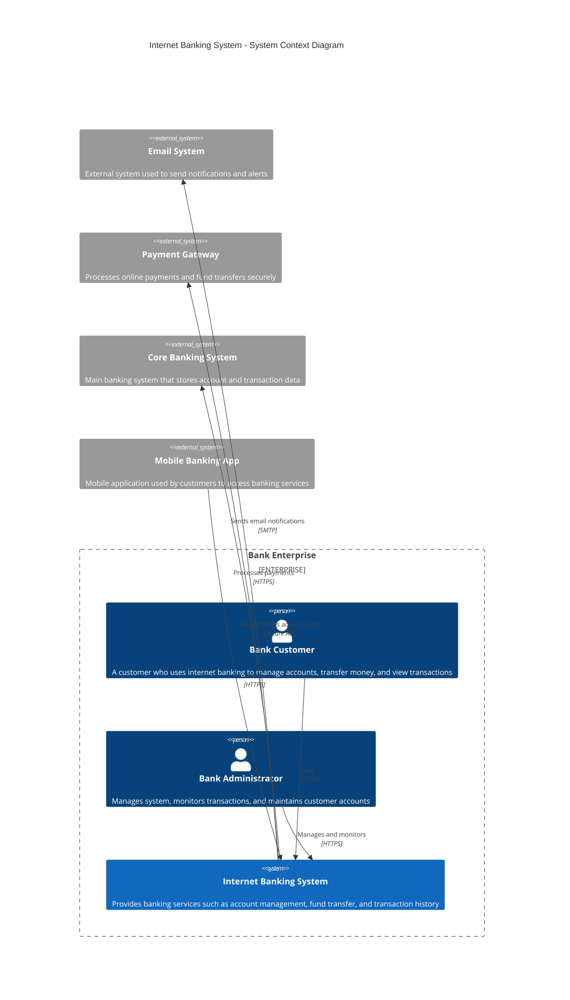
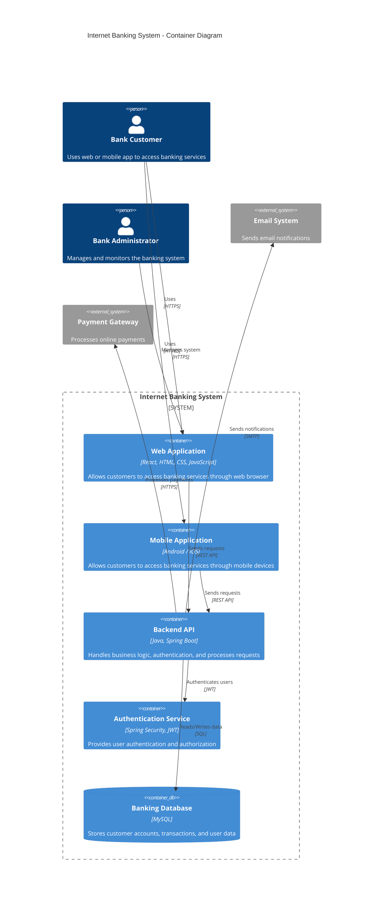
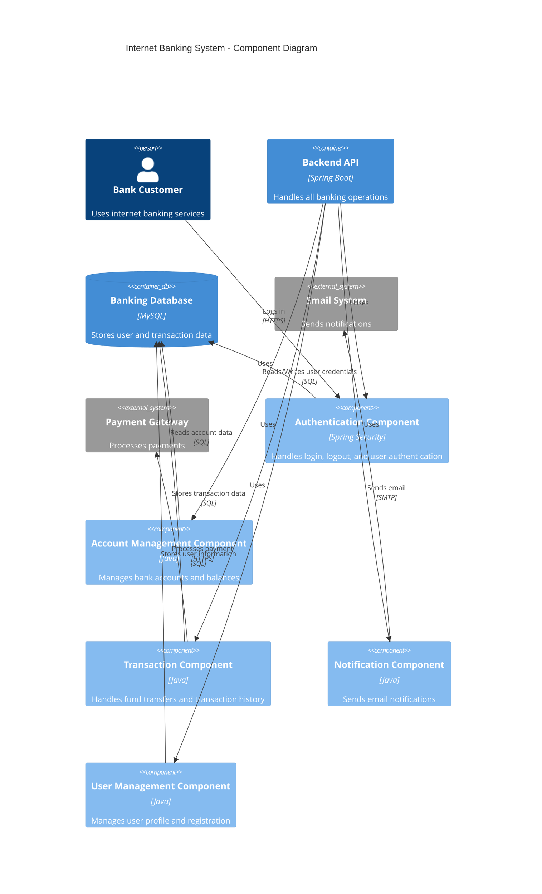
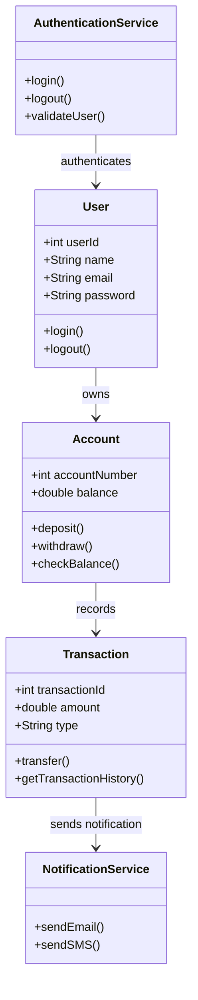

## C4 Diagram : 
The C4 Model is a hierarchical approach for visualizing and documenting software architecture. It was created by Simon Brown to help developers, architects, and stakeholders understand the structure of software systems at different levels of detail.

**C4 stands for:**

* **Context** : Show the system in its broader context , including users , external systems , and high-level goals.
* **Container** : Decomposes the system software into containers or application to be run . Captures the high level technology choices and components.
* **Component**: Depicts the individual components within each container , detailing their specific responsibilites.
* **Code**: Can be used to zoom into specific components and showcase their internal structure or implementation details. This uses class diagram.
* Each level provides a different view of the system, from high-level overview to detailed implementation.

| Level   | Name      | Description                     | Audience               |
| ------- | --------- | ------------------------------- | ---------------------- |
| Level 1 | Context   | System and external interaction | Everyone               |
| Level 2 | Container | Applications and databases      | Developers, Architects |
| Level 3 | Component | Internal components             | Developers             |
| Level 4 | Code      | Classes and code                | Developers             |

## Context Diagram:

## Container Diagram: 

## Component Diagram: 
A Component Diagram is a structural diagram that illustrates the organization and relationships between software components, their interfaces, and dependencies within a system.

The Component Diagram shows the internal structure of the Backend API container. It illustrates the major components such as Authentication, User Management, Account Management, Transaction, and Notification components. These components interact with the database and external systems like Payment Gateway and Email System to perform banking operations securely and efficiently.

## Code Diagram:
A Code Diagram represents the internal implementation of a component by showing classes, interfaces, attributes, methods, and their relationships. It helps developers understand how the system is implemented at the code level.

The Code Diagram provides a detailed view of the system implementation. It shows classes, methods, and relationships, helping developers understand how the system works internally.

