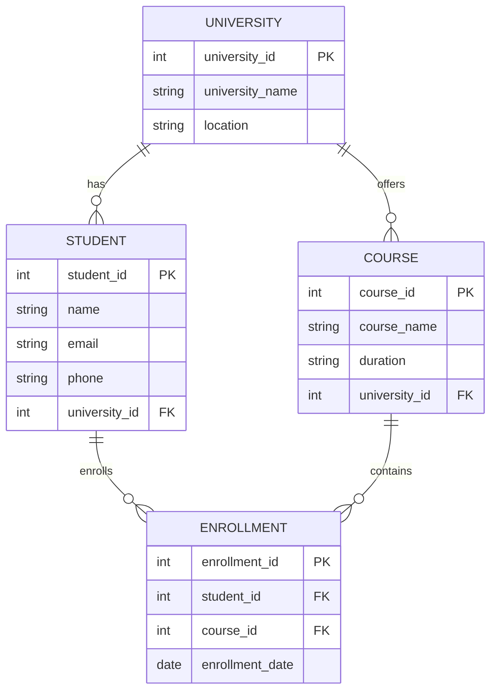
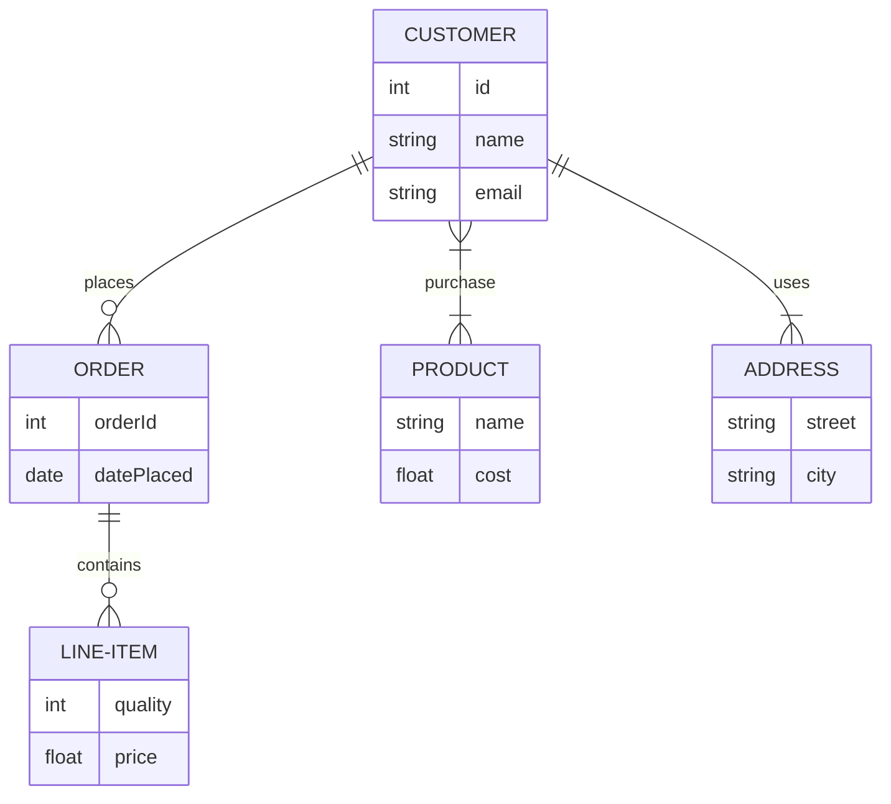

## Entity Relationship Diagram :
ER diagram is a visual representation that illustrate the relationships between entities in a database design to model the structure of a database and the relationship between different entities . ERDs use various symbols to represent entities , attributes and relationships in a clear and concise manner .

## Key Components of an ER Diagram

**An ER Diagram is made of 4 main components:**

* **Entity** : An Entity is a real-world object or thing that can be identified and stored in a database.
* **Attribute** : Attributes describe the properties of an entity.
* **Relationship** : A relationship shows how entities are connected.
* **Cardinality**: Cardinality defines how many instances of one entity relate to another

---
 **Primary Key (PK)**

Primary Key uniquely identifies each record.

Syntax:

int student_id PK

**Foreign Key (FK)**

Foreign Key connects entities.

Syntax:

int student_id FK

---
**Syntax:**

erDiagram
    ENTITY {
        datatype attribute_name KEY_TYPE
    }
    ENTITY1 CARDINALITY ENTITY2 : relationship_name

---
## Basic ER Diagram From Understanding  :

This ER diagram represents a University Management System showing how UNIVERSITY, STUDENT, COURSE, and ENROLLMENT are related.

A UNIVERSITY can have many STUDENTS and offer many COURSES.

A STUDENT can enroll in multiple COURSES, and each enrollment is recorded in the ENROLLMENT entity.

The ENROLLMENT entity acts as a bridge between STUDENT and COURSE and stores enrollment details like enrollment date.

Primary Keys (PK) uniquely identify each entity, and Foreign Keys (FK) connect related entities.

---
## Example :

**CODE:**
erDiagram 
        CUSTOMER ||--o{ ORDER: places
        ORDER ||--o{LINE-ITEM: contains 
        CUSTOMER{
            int id 
            string name 
            string email
        }
        ORDER{
            int orderId
            date datePlaced
        }
        LINE-ITEM{
            int quality 
            float price 
        }
        CUSTOMER}|--|{PRODUCT:purchase
        PRODUCT{
            string name 
            float cost 
        }
        CUSTOMER ||--|{ADDRESS: uses
        ADDRESS{
            string street
            string city
        }

