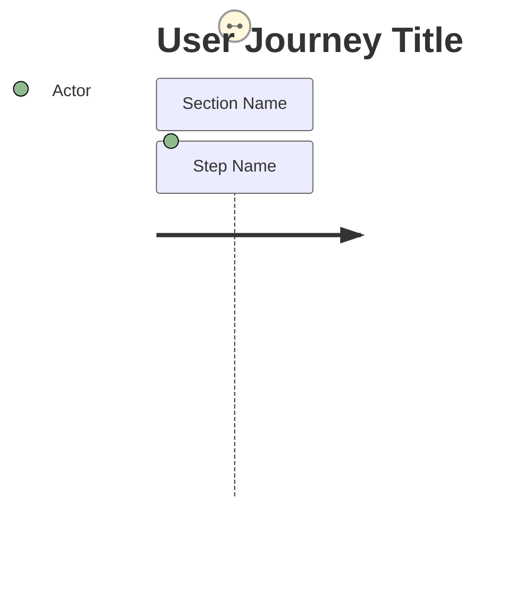
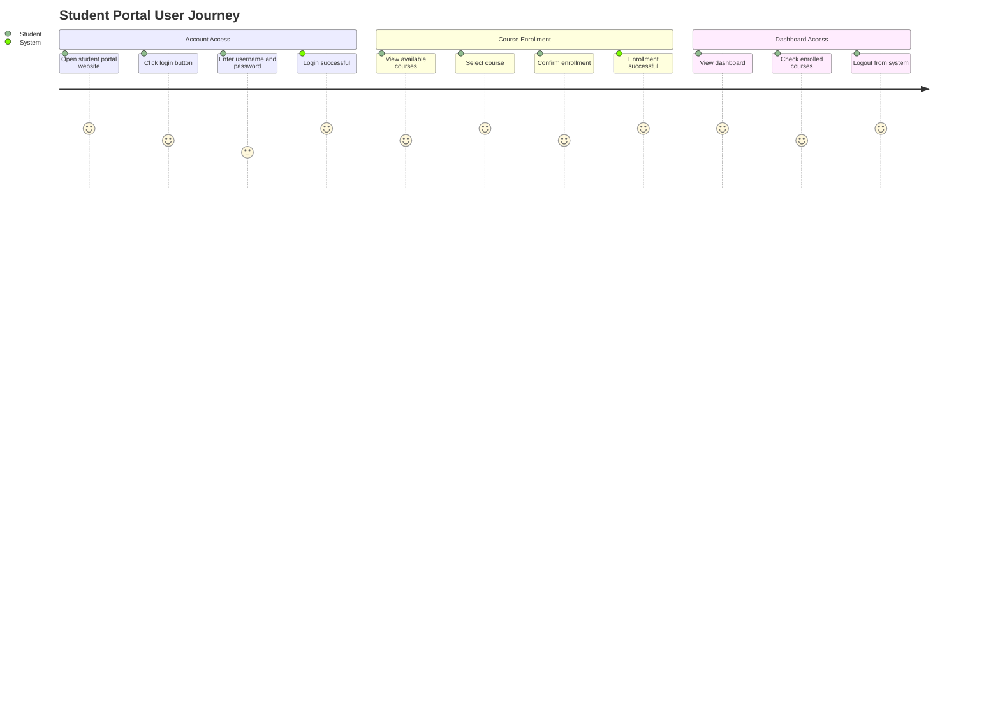
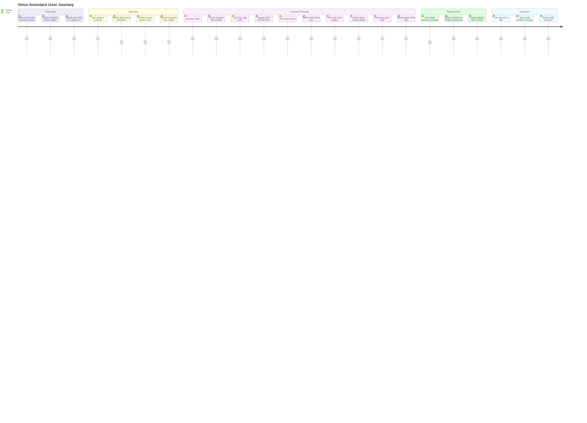

# User Journey Diagram :

A User Journey Diagram represents the step-by-step experience of a user while interacting with a system. It helps visualize user actions, decisions, and system responses from start to goal completion.

This diagram is useful for:

* Understanding user behavior
* Improving user experience (UX)
* Designing software workflows
* Software engineering documentation

---

## Basic Syntax

The User Journey diagram starts with the `journey` keyword.

---

##  Student Portal User Journey

**CODE:**
journey
    title Student Portal User Journey
    section Account Access
      Open student portal website: 5: Student
      Click login button: 4: Student
      Enter username and password: 3: Student
      Login successful: 5: System
    section Course Enrollment
      View available courses: 4: Student
      Select course: 5: Student
      Confirm enrollment: 4: Student
      Enrollment successful: 5: System
    section Dashboard Access
      View dashboard: 5: Student
      Check enrolled courses: 4: Student
      Logout from system: 5: Student

This diagram shows the journey of a student using a student portal system.

* The student opens the portal and logs in.
* The student views and enrolls in courses.
* The system confirms enrollment.
* The student accesses dashboard and logs out.

---

User Journey diagrams help visualize:

* User actions
* User experience
* System interaction
* Process flow

They are important for UX design and software engineering documentation.

---
## Pyhton Project Journey diagram:

---
**A User Journey Diagram is used to visualize the complete interaction between the user and the system. It helps developers, designers, and analysts understand user behavior, improve user experience, design better workflows, and document system processes. It is also useful for system planning, testing, and identifying usability issues.**

---