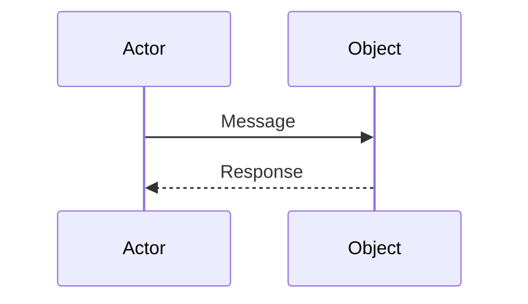

# Sequence Diagrams

## Introduction

A **Sequence Diagram** in the **Unified Modeling Language (UML)** is a type of interaction diagram that shows how processes operate with one another and in what order. It models the sequential logic and time-based interactions between objects or components in a system.

Sequence diagrams are part of the **UML Behavioral Diagrams** family and are widely used to:
- Visualize the flow of messages between objects over time
- Depict the order of operations in a use case
- Show how objects collaborate to accomplish a task
- Document and communicate system behavior

---

## Purpose of Sequence Diagrams

Sequence diagrams are used to:
- Model the interaction between objects in a sequential manner
- Show the time ordering of messages between participants
- Represent the logic and flow of operations
- Document system behavior for stakeholders
- Serve as a blueprint for implementation
- Facilitate communication between developers and designers

In simple terms, a sequence diagram shows **how objects talk to each other over time**.

---

## Basic Concepts

### Lifelines (Participants)

A **Lifeline** (also called Participant) represents an individual object or component in the system. It is represented by a vertical dashed line with a rectangle at the top containing the participant name.

### Activation Boxes

An **Activation Box** (or execution bar) represents the period when an object is actively performing an operation. It appears as a thin vertical rectangle on the lifeline.

### Messages

**Messages** are arrows going from a sender to a receiver. They represent communication between objects and include:
- Method calls
- Data transfer
- Signals
- Return values

### Time Flow

Time flows **downward** on the diagram. The vertical position of messages indicates their chronological order.

---

## Syntax and Notation

### Basic Syntax



**Code:**
```
sequenceDiagram
    participant A as Actor
    participant B as Object
    A->>B: Message
    B-->>A: Response
```

### Declaring Participants

You can declare participants in three ways:

1. **Automatic**: Just use the name in messages
2. **Explicit**: Use `participant` keyword
3. **Alias**: Use `as` keyword for alternative names

```
mermaid
sequenceDiagram
    participant User
    participant System as AuthService
    participant Database
    
    User->>System: Login Request
    System->>Database: Verify Credentials
    Database-->>System: User Data
    System-->>User: Login Success
```

**Code:**
```
sequenceDiagram
    participant User
    participant System as AuthService
    participant Database
    
    User->>System: Login Request
    System->>Database: Verify Credentials
    Database-->>System: User Data
    System-->>User: Login Success
```

---

## Message Types

### Synchronous Messages

A **Synchronous Message** waits for a response before continuing. The sender blocks until the receiver processes the message.

```
mermaid
sequenceDiagram
    participant Client
    participant Server
    
    Client->>Server: Request (sync)
    Server-->>Client: Response
```

**Code:**
```
Client->>Server: Request (sync)
Server-->>Client: Response
```

### Asynchronous Messages

An **Asynchronous Message** does not wait for a response. The sender continues execution immediately after sending the message.

```
mermaid
sequenceDiagram
    participant Client
    participant Server
    
    Client->>Server: Event (async)
    Note over Server: Processing...
```

**Code:**
```
Client->>Server: Event (async)
Note over Server: Processing...
```

### Return Messages

A **Return Message** shows the response from a previous message. It can be solid or dashed.

```
mermaid
sequenceDiagram
    participant A
    participant B
    
    A->>B: Request
    B-->>A: Response
    A->>B: Another Request
    B-->>A: Result
```

**Code:**
```
A->>B: Request
B-->>A: Response
A->>B: Another Request
B-->>A: Result
```

### Self-Calls

A **Self-Call** is when an object sends a message to itself, representing a method calling another method within the same object.

```
mermaid
sequenceDiagram
    participant Object
    
    Object->>Object: methodA()
    Object->>Object: methodB()
    Object->>Object: methodC()
```

**Code:**
```
Object->>Object: methodA()
Object->>Object: methodB()
Object->>Object: methodC()
```

### Create and Delete Messages

```
mermaid
sequenceDiagram
    participant Creator
    participant Object
    participant Destroyer
    
    Creator->>Object: create()
    Destroyer->>Object: destroy()
```

**Code:**
```
Creator->>Object: create()
Destroyer->>Object: destroy()
```

---

## Arrow Types

| Arrow Type | Meaning | Symbol |
|-----------|---------|--------|
| Solid with filled head | Synchronous message | `->>` |
| Solid with arrow head | Synchronous message | `->` |
| Dashed with arrow head | Return message | `-->>` |
| Arrow from arrow | Asynchronous message | `->>` |
| Dotted with arrow | Asynchronous message | `-.->` |
| Long arrow with X | Found message | `-->` |
| Long arrow with X | Lost message | `-->x` |

---

## Activation Boxes

### Showing Activation

Activation boxes show when an object is actively processing a request.

```
mermaid
sequenceDiagram
    participant User
    participant System
    participant Database
    
    User->>System: Request
    activate System
    System->>Database: Query
    activate Database
    Database-->>System: Result
    deactivate Database
    System-->>User: Response
    deactivate System
```

**Code:**
```
User->>System: Request
activate System
System->>Database: Query
activate Database
Database-->>System: Result
deactivate Database
System-->>User: Response
deactivate System
```

### Auto Activation

You can use `activate` and `deactivate` keywords to show execution.

```
mermaid
sequenceDiagram
    participant Client
    participant Service
    
    Client->>+Service: Call 1
    Service-->>-Client: Response 1
    Client->>+Service: Call 2
    Service-->>-Client: Response 2
```

**Code:**
```
Client->>+Service: Call 1
Service-->>-Client: Response 1
Client->>+Service: Call 2
Service-->>-Client: Response 2
```

---

## Notes

### Adding Notes

Notes can be placed on the diagram to add explanations.

```
mermaid
sequenceDiagram
    participant A
    participant B
    
    A->>B: Message
    Note over A: This is a note for A
    Note over B: This is a note for B
    Note over A,B: This is a note over both
```

**Code:**
```
A->>B: Message
Note over A: This is a note for A
Note over B: This is a note for B
Note over A,B: This is a note over both
```

---

## Control Structures

### Opt (Optional)

The **Opt** fragment represents optional behavior that may or may not execute.

```
mermaid
sequenceDiagram
    participant User
    participant System
    
    User->>System: Request
    opt [condition]
        System->>Database: Check
        Database-->>System: Data
    end
    System-->>User: Response
```

**Code:**
```
User->>System: Request
opt [condition]
    System->>Database: Check
    Database-->>System: Data
end
System-->>User: Response
```

### Alt (Alternative)

The **Alt** fragment represents if-else conditional logic.

```
mermaid
sequenceDiagram
    participant User
    participant System
    
    User->>System: Login Request
    alt Valid Credentials
        System->>Database: Verify
        Database-->>System: Success
        System-->>User: Welcome
    else Invalid Credentials
        System-->>User: Error Message
    end
```

**Code:**
```
User->>System: Login Request
alt Valid Credentials
    System->>Database: Verify
    Database-->>System: Success
    System-->>User: Welcome
else Invalid Credentials
    System-->>User: Error Message
end
```

### Loop

The **Loop** fragment represents repeated execution.

```
mermaid
sequenceDiagram
    participant User
    participant System
    
    User->>System: Process Items
    loop [for each item]
        System->>System: Validate
        System->>Database: Save
        Database-->>System: Confirm
    end
    System-->>User: Complete
```

**Code:**
```
User->>System: Process Items
loop [for each item]
    System->>System: Validate
    System->>Database: Save
    Database-->>System: Confirm
end
System-->>User: Complete
```

### Break

The **Break** fragment represents a condition that exits the loop or scenario.

```
mermaid
sequenceDiagram
    participant User
    participant System
    
    User->>System: Process
    loop Continue
        System->>System: Check
        break [error]
            System-->>User: Error
        end
    end
```

**Code:**
```
User->>System: Process
loop Continue
    System->>System: Check
    break [error]
        System-->>User: Error
    end
end
```

### Par (Parallel)

The **Par** fragment represents parallel execution of multiple fragments.

```
mermaid
sequenceDiagram
    participant User
    participant EmailService
    participant SMSService
    participant Database
    
    User->>Database: Submit Form
    par
        Database->>EmailService: Send Email
        EmailService-->>User: Email Sent
    and
        Database->>SMSService: Send SMS
        SMSService-->>User: SMS Sent
    end
```

**Code:**
```
User->>Database: Submit Form
par
    Database->>EmailService: Send Email
    EmailService-->>User: Email Sent
and
    Database->>SMSService: Send SMS
    SMSService-->>User: SMS Sent
end
```

### Critical Region

The **Critical** fragment represents a section that must execute atomically.

```
mermaid
sequenceDiagram
    participant Thread1
    participant Thread2
    participant Resource
    
    Thread1->>Resource: Request
    critical
        Thread1->>Resource: Update
        Resource-->>Thread1: Done
    end
    Thread2->>Resource: Request
```

**Code:**
```
Thread1->>Resource: Request
critical
    Thread1->>Resource: Update
    Resource-->>Thread1: Done
end
Thread2->>Resource: Request
```

### Seq (Weak Sequencing)

The **Seq** fragment ensures that messages within different subfragments occur in sequence.

```
mermaid
sequenceDiagram
    participant A
    participant B
    participant C
    
    A->>B: Request 1
    seq
        B->>C: Process 1
        B->>C: Process 2
    end
    A->>B: Request 2
```

**Code:**
```
A->>B: Request 1
seq
    B->>C: Process 1
    B->>C: Process 2
end
A->>B: Request 2
```

---

## Advanced Features

### Links to External Pages

You can create clickable links in sequence diagrams.

```
mermaid
sequenceDiagram
    participant U as User
    participant S as Server
    
    U->>S: Request
    S-->>U: Response
    
    link S: Documentation @https://example.com
```

**Code:**
```
participant U as User
participant S as Server

U->>S: Request
S-->>U: Response

link S: Documentation @https://example.com
```

### Styling

You can apply custom styling to sequence diagrams.

```
mermaid
sequenceDiagram
    participant A
    participant B
    
    A->>B: Message
    B-->>A: Response
    
    style A fill:#f9f,stroke:#333
    style B fill:#bbf,stroke:#333
```

**Code:**
```
participant A
participant B

A->>B: Message
B-->>A: Response

style A fill:#f9f,stroke:#333
style B fill:#bbf,stroke:#333
```

### Space and Length

You can add spacing to improve readability.

```
mermaid
sequenceDiagram
    participant A
    participant B
    
    A->>B: Message 1
    space
    A->>B: Message 2
    space(5)
    A->>B: Message 3
```

**Code:**
```
A->>B: Message 1
space
A->>B: Message 2
space(5)
A->>B: Message 3
```

### Rectangle Background

You can add background rectangles to group related elements.

```
mermaid
sequenceDiagram
    participant A
    participant B
    participant C
    
    rect rgb(200, 220, 255)
        A->>B: Step 1
        B-->>A: Done
    end
    
    rect rgb(220, 255, 220)
        B->>C: Step 2
        C-->>B: Done
    end
```

**Code:**
```
participant A
participant B
participant C

rect rgb(200, 220, 255)
    A->>B: Step 1
    B-->>A: Done
end

rect rgb(220, 255, 220)
    B->>C: Step 2
    C-->>B: Done
end
```

---

## Real-World Examples

### Example 1: User Login Process

```
mermaid
sequenceDiagram
    participant User
    participant UI
    participant AuthService
    participant Database
    
    User->>UI: Enter Credentials
    UI->>AuthService: Validate Request
    activate AuthService
    AuthService->>Database: Check User
    activate Database
    Database-->>AuthService: User Data
    deactivate Database
    AuthService-->>UI: Success/Failure
    deactivate AuthService
    UI-->>User: Display Result
```

**Code:**
```
sequenceDiagram
    participant User
    participant UI
    participant AuthService
    participant Database
    
    User->>UI: Enter Credentials
    UI->>AuthService: Validate Request
    activate AuthService
    AuthService->>Database: Check User
    activate Database
    Database-->>AuthService: User Data
    deactivate Database
    AuthService-->>UI: Success/Failure
    deactivate AuthService
    UI-->>User: Display Result
```

### Example 2: Online Shopping Checkout

```
mermaid
sequenceDiagram
    participant Customer
    participant Cart
    participant Payment
    participant Order
    participant Inventory
    
    Customer->>Cart: View Cart
    Cart-->>Customer: Display Items
    
    Customer->>Cart: Proceed to Checkout
    Cart->>Payment: Process Payment
    activate Payment
    Payment-->>Cart: Payment Success
    deactivate Payment
    
    Cart->>Order: Create Order
    activate Order
    Order->>Inventory: Reserve Items
    activate Inventory
    Inventory-->>Order: Items Reserved
    deactivate Inventory
    Order-->>Cart: Order Created
    deactivate Order
    
    Cart-->>Customer: Order Confirmation
```

**Code:**
```
sequenceDiagram
    participant Customer
    participant Cart
    participant Payment
    participant Order
    participant Inventory
    
    Customer->>Cart: View Cart
    Cart-->>Customer: Display Items
    
    Customer->>Cart: Proceed to Checkout
    Cart->>Payment: Process Payment
    activate Payment
    Payment-->>Cart: Payment Success
    deactivate Payment
    
    Cart->>Order: Create Order
    activate Order
    Order->>Inventory: Reserve Items
    activate Inventory
    Inventory-->>Order: Items Reserved
    deactivate Inventory
    Order-->>Cart: Order Created
    deactivate Order
    
    Cart-->>Customer: Order Confirmation
```

### Example 3: ATM Withdrawal

```
mermaid
sequenceDiagram
    participant User
    participant ATM
    participant Bank
    participant Account
    
    User->>ATM: Insert Card
    ATM->>Bank: Verify Card
    Bank-->>ATM: Card Valid
    ATM->>User: Enter PIN
    User->>ATM: Enter PIN
    ATM->>Bank: Verify PIN
    Bank->>Account: Check Balance
    Account-->>Bank: Balance Info
    Bank-->>ATM: PIN Valid
    
    alt Sufficient Balance
        ATM->>User: Enter Amount
        User->>ATM: Enter Amount
        ATM->>Account: Debit Amount
        Account-->>ATM: Debit Success
        ATM->>User: Dispense Cash
    else Insufficient Balance
        ATM->>User: Insufficient Funds
    end
    
    ATM->>User: Return Card
    User->>ATM: Take Card
```

**Code:**
```
sequenceDiagram
    participant User
    participant ATM
    participant Bank
    participant Account
    
    User->>ATM: Insert Card
    ATM->>Bank: Verify Card
    Bank-->>ATM: Card Valid
    ATM->>User: Enter PIN
    User->>ATM: Enter PIN
    ATM->>Bank: Verify PIN
    Bank->>Account: Check Balance
    Account-->>Bank: Balance Info
    Bank-->>ATM: PIN Valid
    
    alt Sufficient Balance
        ATM->>User: Enter Amount
        User->>ATM: Enter Amount
        ATM->>Account: Debit Amount
        Account-->>ATM: Debit Success
        ATM->>User: Dispense Cash
    else Insufficient Balance
        ATM->>User: Insufficient Funds
    end
    
    ATM->>User: Return Card
    User->>ATM: Take Card
```

---

## Best Practices

### Do's ✅

1. **Keep it focused**: Limit the number of participants to essential ones
2. **Use clear names**: Give meaningful names to participants and messages
3. **Show time flow**: Ensure messages flow downward in chronological order
4. **Use activation bars**: Show when objects are actively processing
5. **Add notes**: Explain complex interactions with notes
6. **Group related elements**: Use fragments to group related messages
7. **Maintain consistency**: Use consistent message types throughout

### Don'ts ❌

1. **Don't overload**: Avoid too many participants in one diagram
2. **Don't skip returns**: Always show return messages for clarity
3. **Don't use vague messages**: Be specific in message names
4. **Don't ignore loops**: Use loop fragments for repeated actions
5. **Don't forget alternatives**: Show alternative paths with alt fragments

---

## Tools Used

- Visual Studio Code
- Markdown (`.md`)
- Mermaid
- Markdown Preview Mermaid Support Extension
- Git & GitHub

---

## Learning Outcomes

- Learned UML Sequence Diagram fundamentals
- Understood basic syntax and notation
- Mastered different message types
- Practiced control structures (opt, alt, loop, par)
- Created real-world sequence diagrams
- Applied best practices in diagram design

---

## Summary

Sequence diagrams are powerful tools for visualizing the temporal behavior of systems. They show how objects interact over time through message passing, making complex system behaviors easier to understand and communicate.

Key takeaways:
- **Lifelines** represent participants in the interaction
- **Messages** show communication between participants
- **Activation bars** indicate when processing occurs
- **Control structures** (opt, alt, loop, par) handle complex logic
- **Notes** add explanatory information
- **Styling** improves diagram aesthetics

Mermaid provides an excellent way to create sequence diagrams directly in Markdown files, making documentation maintainable and collaborative.

---
