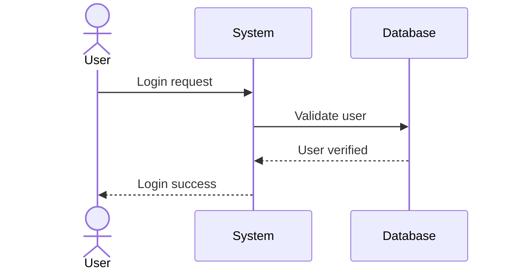
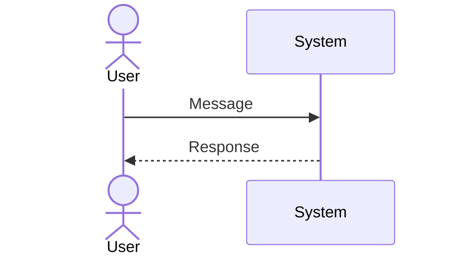
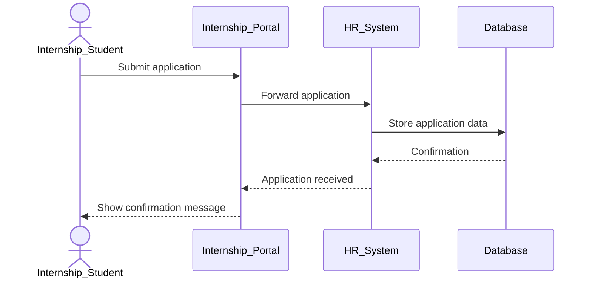
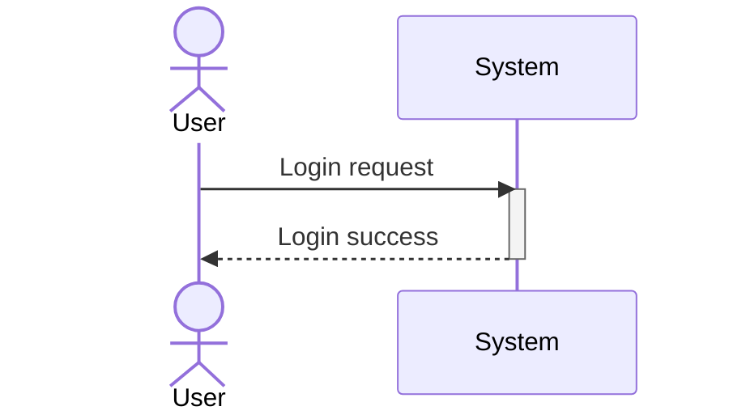
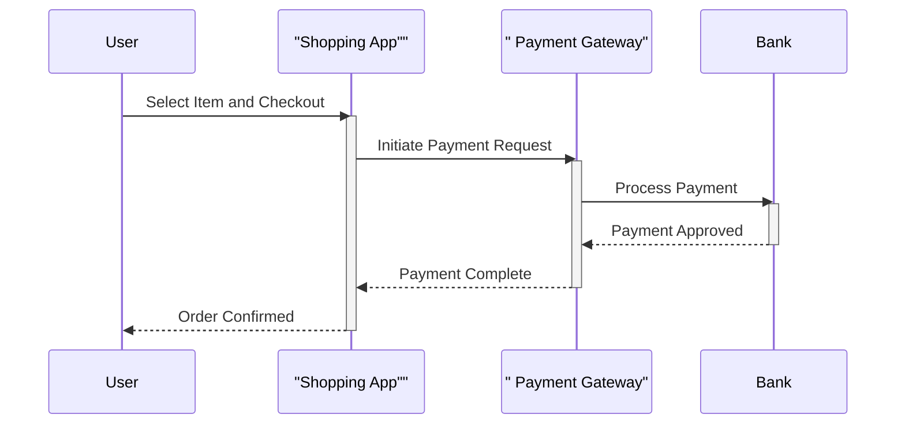
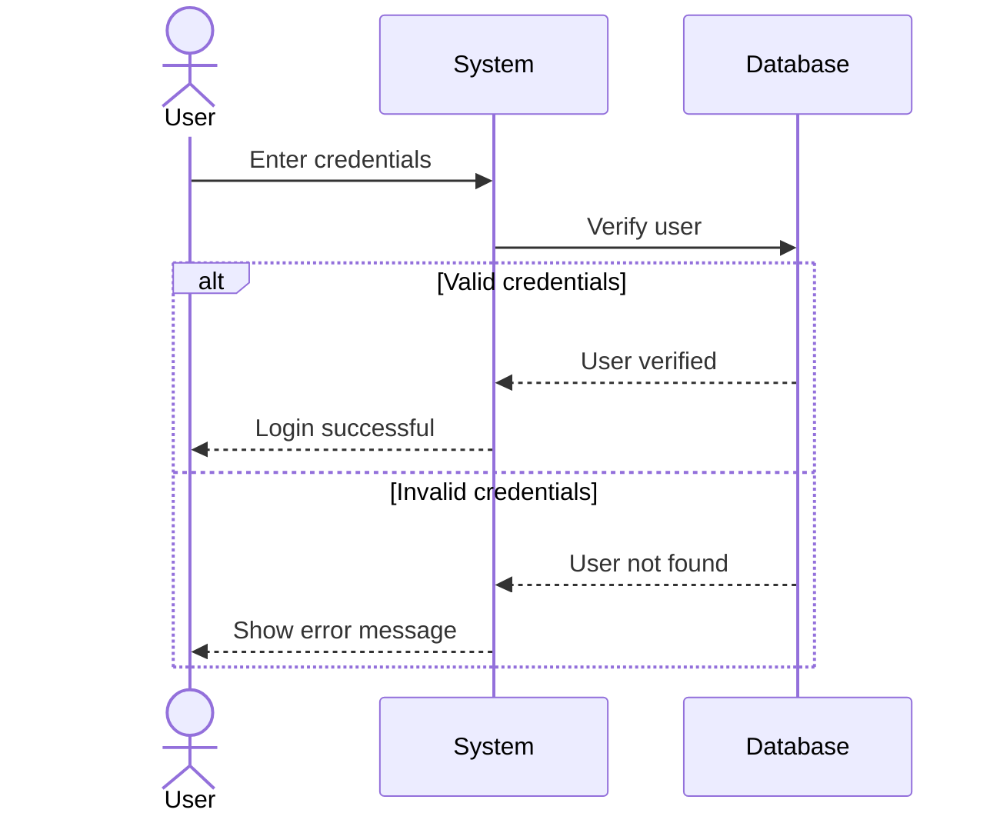
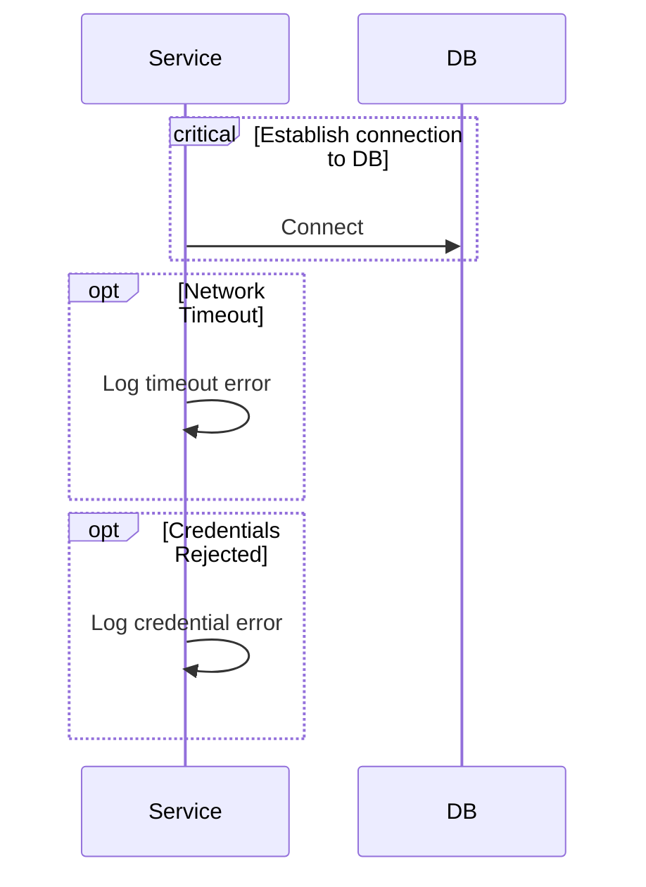
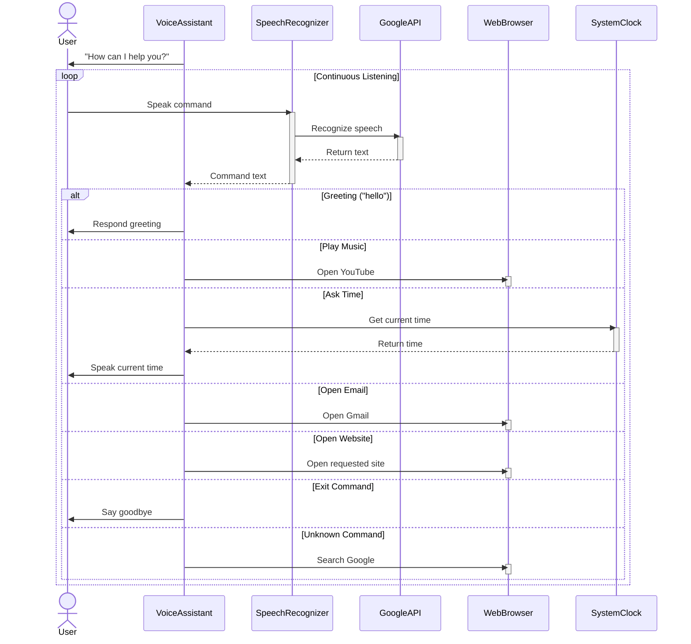

# Sequence Diagrams

## Introduction

A **Sequence Diagram** in the **Unified Modeling Language (UML)** is a type of interaction diagram that shows how processes operate with one another and in what order. It models the sequential logic and time-based interactions between objects or components in a system.

Sequence diagrams are part of the **UML Behavioral Diagrams** family and are widely used to:
- Visualize the flow of messages between objects over time
- Depict the order of operations in a use case
- Show how objects collaborate to accomplish a task
- Document and communicate system behavior

---

## Purpose of Sequence Diagrams

Sequence diagrams are used to:
- Model the interaction between objects in a sequential manner
- Show the time ordering of messages between participants
- Represent the logic and flow of operations
- Document system behavior for stakeholders
- Serve as a blueprint for implementation
- Facilitate communication between developers and designers

In simple terms, a sequence diagram shows **how objects talk to each other over time**.

---

# Use Case :
A Sequence Diagram is used to show:

- How different objects interact
- The order of communication
- The flow of messages over time
- Runtime behavior of a system

## Creating and Connecting Participants :

A participant in a sequence diagram is an object or component that takes part in communication.

Participants can be:

👤 Users (Actor)
🖥️ System components
🗄️ Database
🔧 Services
🌐 APIs



# Sequence Diagram – Objects 


In UML, a **Sequence Diagram** represents how objects interact with each other in a particular scenario over time.

Sequence diagrams focus on:

- Object interaction  
- Message flow  
- Execution order  
- Runtime behavior  

Time flows from **top to bottom**.


## Sequence Diagram Objects

In a sequence diagram, objects are called **Participants**.

They represent the entities that send and receive messages.


##  Types of Sequence Objects

## Actor

Represents an external entity interacting with the system.

Syntax:

```
actor Name
```

---

### Participant

Represents an internal system component.

Syntax:

```
participant Name
```

---

## Basic Structure



```
sequenceDiagram
actor User
participant System

User ->> System: Message
System -->> User: Response
```

---


## Example :
An internship student submits an application.  
The portal processes it and stores data in the database.

## CODE:
sequenceDiagram
actor Internship_Student
participant Internship_Portal
participant HR_System
participant Database

Internship_Student ->> Internship_Portal: Submit application
Internship_Portal ->> HR_System: Forward application
HR_System ->> Database: Store application data
Database -->> HR_System: Confirmation
HR_System -->> Internship_Portal: Application received
Internship_Portal -->> Internship_Student: Show confirmation message



| Object | Type | Role |
|--------|------|------|
| Internship_Student | Actor | External user applying |
| Internship_Portal | Participant | System interface |
| HR_System | Participant | Handles application review |
| Database | Participant | Stores application data |


## How Participants Are Connected

Participants are connected using arrows.

### Message Types:

| Arrow | Meaning |
|--------|----------|
| `->>` | Request / Call |
| `-->>` | Response |
| `--x` | Termination |
| `-)` | Asynchronous call |


- Participants must be declared before messages.
- Order of messages represents execution order.
- Time flows vertically.
- Messages flow horizontally.
- Actors represent external interaction.
- Participants represent internal system components.

## Activation Box :
An Activation Box (also called Execution Specification) is the thin vertical rectangle drawn on a participant’s lifeline in a sequence diagram.
It represents:
The time period during which an object is actively executing a process or method.


**Syntax:**
sequenceDiagram
actor User
participant System

User ->> System: Login request
**activate System**
System -->> User: Login success
**deactivate System**


---

## Example : 

**CODE**
sequenceDiagram 
    participant User 
    participant App as "Shopping App""
    participant Gateway as " Payment Gateway"
    participant Bank 
    User->>App: Select Item and Checkout
    activate App
    App->>Gateway : Initiate Payment Request 
    activate Gateway 
    Gateway->>Bank: Process Payment
    activate Bank
    Bank-->>Gateway: Payment Approved 
    deactivate Bank
    Gateway-->>App: Payment Complete
    deactivate Gateway
    App-->>User: Order Confirmed
    deactivate App
    
---

## Alternative Frame :
An Alternative Frame (written as alt) is used to represent:

Conditional logic (If–Else decision) in a sequence diagram.

It shows that only one condition executes at a time based on the situation.

**Use alt when:**

Login success / failure
Payment approved / declined
Application accepted / rejected
Valid input / invalid input
System error handling

---
**Syntax:**
alt Condition 1
    messages
else Condition 2
    messages
end

---
## Example :


**CODE:**
sequenceDiagram
actor User
participant System
participant Database

User ->> System: Enter credentials
System ->> Database: Verify user

**alt Valid credentials**
    Database -->> System: User verified
    System -->> User: Login successful
**else Invalid credentials**
    Database -->> System: User not found
    System -->> User: Show error message
end


## Critical Region :
A Critical Region (also called critical fragment) represents:
A section of interaction that must execute atomically — without interruption.


**CODE:**
sequenceDiagram 
    participant Service
    participant DB
    critical Establish connection to DB
        Service->>DB: Connect
    end
    opt Network Timeout
        Service->>Service: Log timeout error
    end
    opt Credentials Rejected
        Service->>Service: Log credential error
    end


## Python Project Voice Assistant Sequence Diagram:



**CODE:**
sequenceDiagram

actor User
participant VoiceAssistant
participant SpeechRecognizer
participant GoogleAPI
participant WebBrowser
participant SystemClock
VoiceAssistant ->> User: "How can I help you?"
loop Continuous Listening
    User ->> SpeechRecognizer: Speak command
    activate SpeechRecognizer
    SpeechRecognizer ->> GoogleAPI: Recognize speech
    activate GoogleAPI
    GoogleAPI -->> SpeechRecognizer: Return text
    deactivate GoogleAPI
    SpeechRecognizer -->> VoiceAssistant: Command text
    deactivate SpeechRecognizer
    alt Greeting ("hello")
        VoiceAssistant ->> User: Respond greeting
    else Play Music
        VoiceAssistant ->> WebBrowser: Open YouTube
        activate WebBrowser
        deactivate WebBrowser
    else Ask Time
        VoiceAssistant ->> SystemClock: Get current time
        activate SystemClock
        SystemClock -->> VoiceAssistant: Return time
        deactivate SystemClock
        VoiceAssistant ->> User: Speak current time
    else Open Email
        VoiceAssistant ->> WebBrowser: Open Gmail
        activate WebBrowser
        deactivate WebBrowser
    else Open Website
        VoiceAssistant ->> WebBrowser: Open requested site
        activate WebBrowser
        deactivate WebBrowser
    else Exit Command
        VoiceAssistant ->> User: Say goodbye
    else Unknown Command
        VoiceAssistant ->> WebBrowser: Search Google
        activate WebBrowser
        deactivate WebBrowser
    end
end
