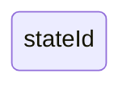
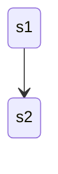
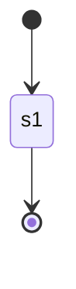
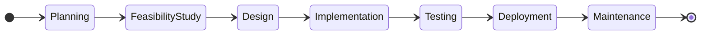
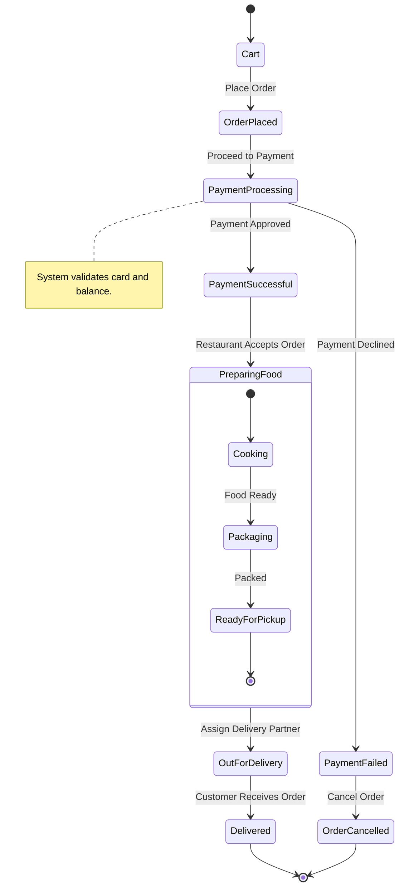
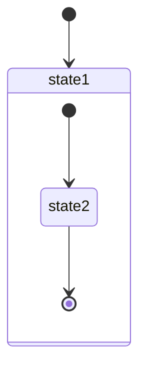
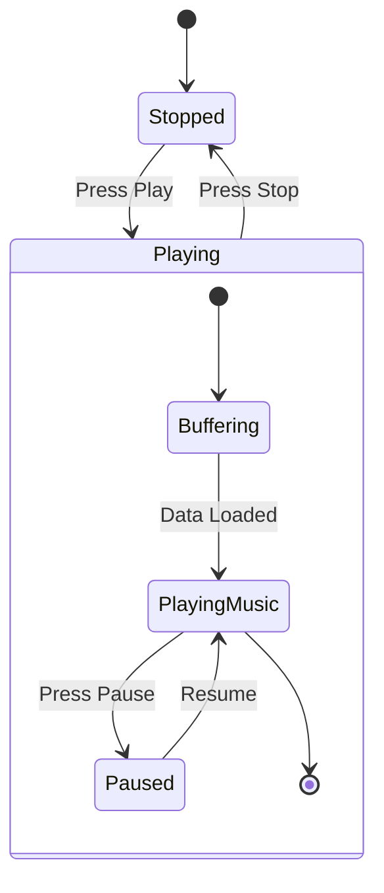
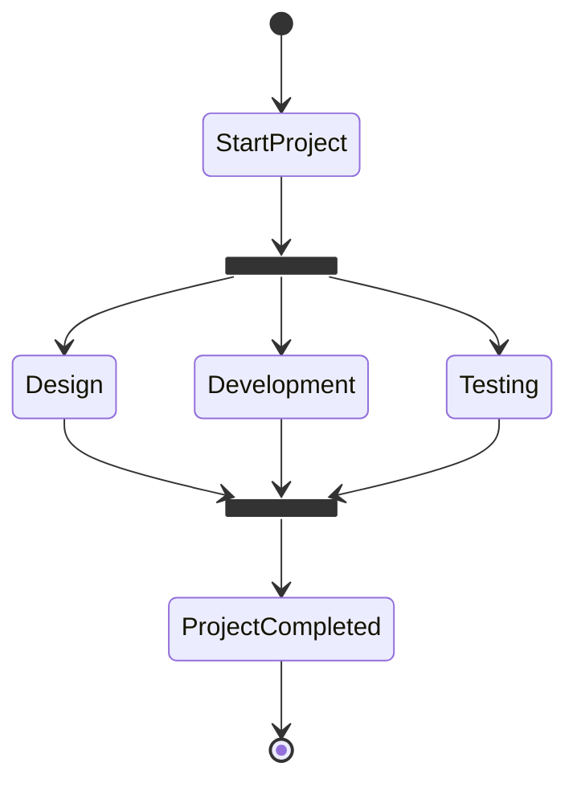
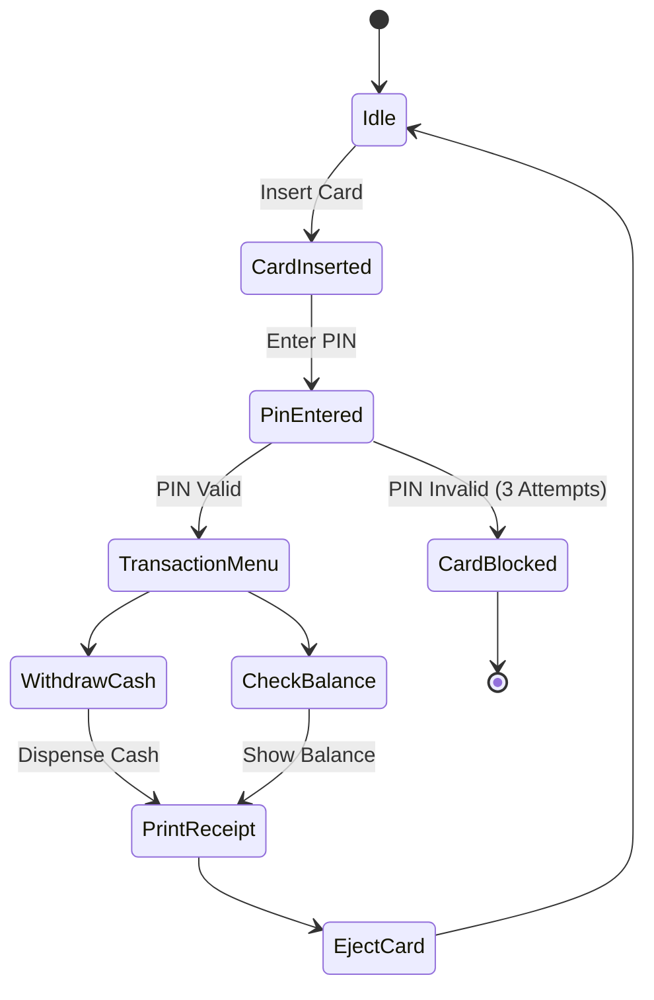

## State Diagram 
A State Diagram (State Machine Diagram) shows:
How an object changes from one state to another based on events.

State diagrams require that the system described is composed of a finite number of states; sometimes, this is indeed the case, while at other times this is a reasonable abstraction.

**It represents:**

* States
* Transitions
* Events
* Initial state
* Final state

**States:**
A state can be declared in multiple ways. The simplest way is to define a state with just an id:

**Transitions:**
Transitions are path/edges when one state passes into another. This is represented using text arrow, "-->".

**Start and End**
There are two special states indicating the start and stop of the diagram. These are written with the [*] syntax and the direction of the transition to it defines it either as a start or a stop state.

---
## Example : State Diagram of SDLC

**CODE**
stateDiagram-v2
    [*] --> Planning 
    Planning-->FeasibilityStudy
    FeasibilityStudy -->Design 
    Design --> Implementation
    Implementation-->Testing
    Testing --> Deployment
    Deployment-->Maintenance
    Maintenance-->[*]

---

## Describing and Labeling State Diagram 

**CODE:**
stateDiagram-v2

[*] --> Cart

Cart --> OrderPlaced : Place Order
OrderPlaced --> PaymentProcessing : Proceed to Payment

PaymentProcessing --> PaymentSuccessful : Payment Approved
PaymentProcessing --> PaymentFailed : Payment Declined

PaymentFailed --> OrderCancelled : Cancel Order

PaymentSuccessful --> PreparingFood : Restaurant Accepts Order

state PreparingFood {
    [*] --> Cooking
    Cooking --> Packaging : Food Ready
    Packaging --> ReadyForPickup : Packed
    ReadyForPickup --> [*]
}

PreparingFood --> OutForDelivery : Assign Delivery Partner
OutForDelivery --> Delivered : Customer Receives Order

Delivered --> [*]
OrderCancelled --> [*]

note right of PaymentProcessing
  System validates card and balance.

end note

---
## Composite State :

A Composite state is a  state that contains other states inside it.

**It is used when:**

* A state has internal sub-processes
* You want to model detailed behavior inside a main state
* The system has hierarchical behavior

**Example:**

**CODE:**
stateDiagram-v2
[*] --> Stopped
Stopped --> Playing : Press Play
state Playing {
    [*] --> Buffering
    Buffering --> PlayingMusic : Data Loaded
    PlayingMusic --> Paused : Press Pause
    Paused --> PlayingMusic : Resume
    PlayingMusic --> [*]
}

Playing --> Stopped : Press Stop

---

## Fork & Join :
Fork and Join are used to represent parallel execution in a state diagram.

* Fork: Splits one state into multiple parallel states.

* Join: Merges multiple parallel states back into one state.

**CODE:**

stateDiagram-v2
[*] --> StartProject
state fork2 <<fork>>
state join2 <<join>>
StartProject --> fork2
fork2 --> Design
fork2 --> Development
fork2 --> Testing
Design --> join2
Development --> join2
Testing --> join2
join2 --> ProjectCompleted
ProjectCompleted --> [*]

---

## State Diagram Of ATM Machine :

**CODE:**

stateDiagram-v2
[*] --> Idle
Idle --> CardInserted : Insert Card
CardInserted --> PinEntered : Enter PIN
PinEntered --> TransactionMenu : PIN Valid
PinEntered --> CardBlocked : PIN Invalid (3 Attempts)
TransactionMenu --> WithdrawCash
TransactionMenu --> CheckBalance
WithdrawCash --> PrintReceipt : Dispense Cash
CheckBalance --> PrintReceipt : Show Balance
PrintReceipt --> EjectCard
EjectCard --> Idle
CardBlocked --> [*]

---
