#  UML Flowcharts using Mermaid 

##  Introduction

Flowcharts are used to represent the **step-by-step flow of a process** in a visual manner.
They are composed of **nodes** (shapes) and **edges** (arrows) that describe the execution flow.

In **UML terminology**, a flowchart is formally known as an **Activity Diagram**.
It is widely used to model actions, decisions, and outcomes within a system.

---

##  When to Use UML Flowcharts

UML Flowcharts are useful in the following scenarios:

- Explaining **business logic**
- Visualizing **process flow**
- Documenting **use cases**
- Communicating system behavior to **mentors and non-technical users**

---

##  Common Flowchart Symbols

| Symbol | Meaning |
|------|--------|
| `((Start))` | Start / End |
| `[Process]` | Activity |
| `{Decision}` | Decision Point |
| `-->` | Flow Direction |

---

##  Node Shapes in Mermaid Flowcharts

The diagram below demonstrates different node shapes supported by Mermaid.

---

##  Example 1: Login Authentication Flow

### Flow Description

This flowchart represents the **user login authentication process**:
1. User enters username and password
2. System checks for empty fields
3. Credentials are validated
4. User is either logged in or shown an error message

**Explanation:**  
This UML activity diagram shows input validation, credential verification, and both success and failure paths.

**Code** :
flowchart TB
    Start((Start))
    Input[Enter Username & Password]
    Empty{Are fields empty?}
    Auth{Credentials valid?}
    Success[Login Successful]
    Error[Show Error Message]
    End((End))
    Start --> Input
    Input --> Empty
    Empty -- Yes --> Error --> End
    Empty -- No --> Auth
    Auth -- Yes --> Success --> End
    Auth -- No --> Error

---

##  Example 2: User Registration Flow with Retry

### Flow Description

This flowchart models the **user registration process**:
1. User enters registration details
2. System validates input
3. Duplicate user check is performed
4. Errors allow retry; success creates an account

**Explanation:**  
This diagram includes input validation, duplicate user checks, error handling, and a retry mechanism.

**Code:**
flowchart TB
    Start((Start))
    Input[Enter Registration Details]
    Validate{Are details valid?}
    Exists{User already exists?}
    Create[Create Account]
    Error[Show Error Message]
    Retry{Retry?}
    End((End))
    Start --> Input
    Input --> Validate
    Validate -- No --> Error --> Retry
    Retry -- Yes --> Input
    Retry -- No --> End

    Validate -- Yes --> Exists
    Exists -- Yes --> Error
    Exists -- No --> Create --> End

---

##  Markdown Strings in Mermaid

Mermaid supports **Markdown-formatted text inside nodes** using backticks.

* This flowchart demonstrates the use of Markdown-formatted text inside Mermaid diagrams.

* The diagram is divided into two subgraphs (“One” and “Two”) to group related nodes.

* Nodes contain multiline text with bold formatting to highlight key terms.

* Labeled arrows show the relationship and flow between nodes.

* Different node shapes are used to represent process and decision elements.

## Code :
flowchart LR
    subgraph "Module One"
        a("`The **message**
        is created here`") -- "transmits data to" --> b{{"`The **receiver**
        processes the data`"}}
    end

    subgraph "`**Module Two**`"
        c("`The **processed message**
        is forwarded`") -- "`Verified **data flow**`" --> d("Final output is generated")
    end

---

## Fontawesome :
Font Awesome icons are used in the documentation sections to improve readability, while Mermaid flowcharts focus purely on logic and structure. Icons are intentionally kept outside the diagrams due to Mermaid limitations.

```mermaid
flowchart LR
    A[👤 User]
    B[🔐 Login]
    C[✅ Success]
    A --> B --> C
``` 

---
##  Tools Used

- Visual Studio Code
- Markdown (`.md`)
- Mermaid
- Markdown Preview Mermaid Support Extension
- Git & GitHub

---

##  Learning Outcomes

- Learned UML Activity (Flowchart) diagrams
- Practiced Mermaid syntax
- Understood Markdown documentation
- Created professional diagrams in VS Code

---

Mermaid provides a simple and effective way to create UML flowcharts directly inside Markdown files.
This approach improves readability, maintainability, and collaboration in software documentation.

---

